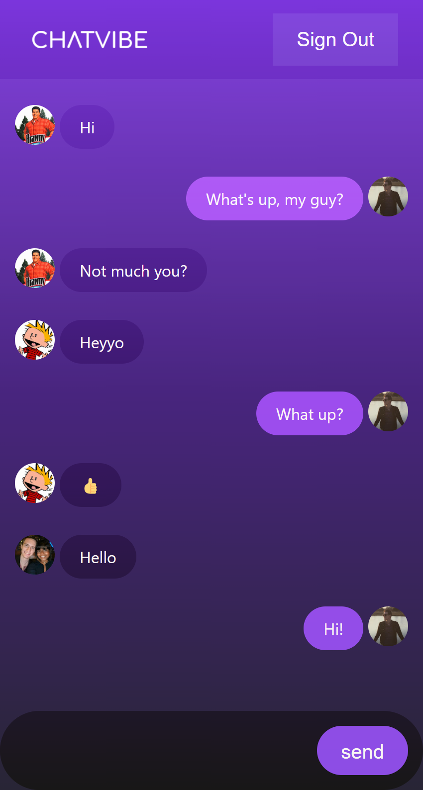

  

  &#xa0;

  <h1><a href="https://chatvibe.app">Click to go to webapp!</a></h1>

<h1 align="center">CHATVIBE</h1>

  

  

  

  <!--  -->

  <!--  -->

  <!--  -->

<!-- Status -->

<!-- <h4 align="center">
	🚧  CHATVIBE 🚀 Under construction...  🚧
</h4>

 -->

  <a href="#dart-about">About</a> &#xa0; | &#xa0;
  <a href="#sparkles-features">Features</a> &#xa0; | &#xa0;
  <a href="#rocket-technologies">Technologies</a> &#xa0; | &#xa0;
  <a href="#memo-license">License</a> &#xa0; | &#xa0;
  <a href="https://github.com/cort-robinson" target="_blank">Author - Cort Robinson</a> &#xa0; | &#xa0;

 

## :dart: About ##

ChatVibe is a webapp that allows users to connect with one another across devices. Running in any browser, users can simply login with a Google acccount and start chatting instantly. The app is currently in development and features such as contact specific group chats have not been implemented.

## :sparkles: Features ##

:heavy_check_mark: Google user authentication;\
:heavy_check_mark: Realtime chat;\
:heavy_check_mark: Google account profile importing;

## :rocket: Technologies ##

The following tools were used in this project:

- [React](https://reactjs.org/)
- [FireBase](https://firebase.google.com/)

## About the Author ##

Cort Robinson:
  Growing up in a military family, Cort has travelled all around the US. Throughout that time he developed a love and passion for technology and computer science. As a graduate at Holberton school of Computer Science, Cort has developed skills across a wide range of technologies and is always excited to expand his knowledge in to new areas.

## :memo: License ##

This project is under license from MIT. For more details, see the [LICENSE](LICENSE.md) file.

Made with :heart: by <a href="https://github.com/cort-robinson" target="_blank">Cort Robinson</a>

* **Cort Robinson** - [GitHub](https://github.com/cort-robinson), [Twitter](https://twitter.com/cort_robinson), [LinkedIn](https://www.linkedin.com/in/cort-robinson-4201b41a9/)
&#xa0;

<a href="#top">Back to top</a>
